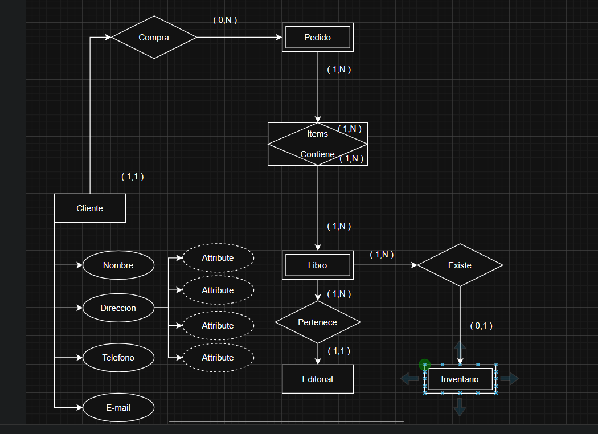
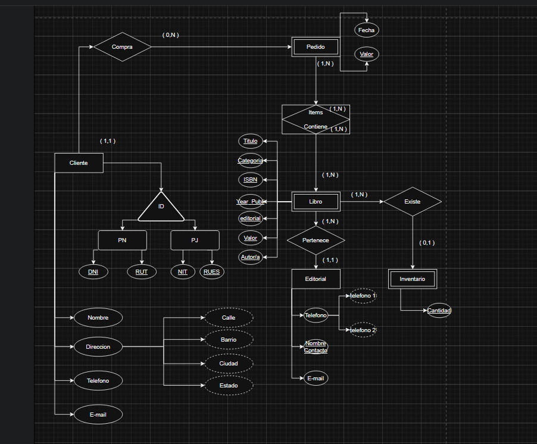
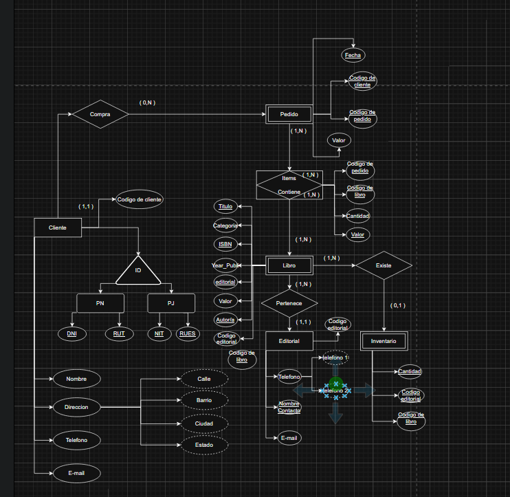

### Atributos

### Para saber más: diferentes tipos de atributos

Los atributos describen las propiedades de las entidades. Por ejemplo, la entidad persona puede tener como atributos: Nombre, fecha de nacimiento, edad, dirección, etc. Al igual que las entidades, también existen algunos tipos de atributo. Estos son:

Atributo simple

Es un tipo de atributo indivisible, o sea, es un atributo atómico. Un ejemplo de este tipo es el atributo DNI, pues este no puede ser dividido en partes menores para formar otros atributos.

Atributo compuesto

Puede ser dividido en partes menores que representan otros atributos, como por ejemplo dirección. Esta puede ser subdividida en atributos menores, como: ciudad, estado, calle, código postal, etc.

Atributo multivalor

Es aquel que puede tener uno o N (varios) valores asociados a él. Por ejemplo: El atributo teléfono de un cliente. Este puede tener uno o varios números de teléfono.

Atributo derivado y almacenado

Los atributos derivados dependen de otro atributo o incluso de otra entidad para existir, como, edad y fecha de nacimiento. Para descubrir la edad de una persona, necesitamos de su fecha de nacimiento. Entonces, consideramos el atributo edad como derivado del atributo fecha de nacimiento, que también se conoce como atributo almacenado.

Atributo clave

Es utilizado para identificar de forma única una entidad, o sea, los valores asociados a este atributo son distintos entre el conjunto de entidades. Como ejemplo, podemos utilizar el Código del Producto. Este es único y puede ser utilizado como atributo clave, dado que cada producto recibe un código en particular.

### Para saber más: clave foránea

Como estudiamos en las últimas aulas, la entidad débil acaba recibiendo la clave principal de la entidad fuerte con la cual está asociada para componer la clave parcial.

Como sabemos, la entidad débil no posee la clave principal. Por este motivo, podemos tener atributos identificadores propios de la entidad débil que van a componer esta clave parcial. Adicionalmente, tenemos la clave principal de la entidad fuerte, que se desplaza hacia la entidad débil.

A esta clave que parte desde la entidad fuerte y llega a la entidad débil damos el nombre de clave foránea. Podríamos hacer una analogía con la palabra foránea, ya que ella originalmente pertenece a otra entidad, y viaja hasta la entidad de destino.

### Lo que aprendimos en esta aula:

    Identificar los tipos de atributos.
    Representar los atributos en diagrams.net.

