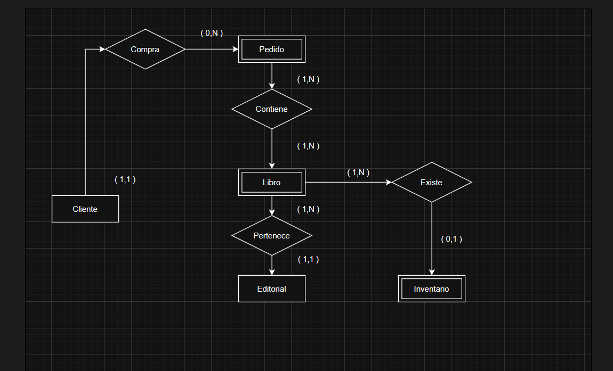
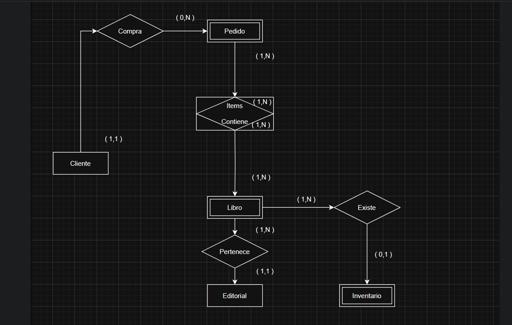
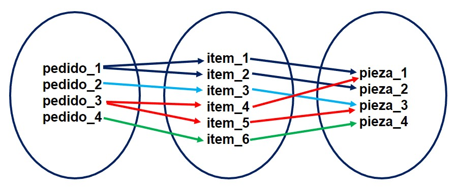

### Tipod de relacion
        las realciones en nuestra base de datos se representa a traves del *rombo*

        Adicionalmente, existen diversos grados de relacion:

                    Colaborador -> trabaja en -> funcion   binaria, ternaria, n-aria = cardinalidad
                                  | relacion |

### Relaciones

### tipos de cardinalidad
        existen los siguientes tipod de cardinalidad (1,1), (0,1), (1,N), (0,N), (M,N)

        Departamento -> Gestiona -> Colaborador 1,1

        departamento -> trabaja -> Colaboradores  1,N

        pedidos -> contenido -> Libros  M,N

### Representando las relaciones

siempre hay que definir la cardinalidad minima y la cardinalidad maxima

### Para saber más: restricción de participación

De acuerdo con las referencias utilizadas para realizar tus estudios, puedes encontrar otra forma de representar la cardinalidad mínima, conocida como restricción de participación o dependencia de existencia.

La restricción de participación es utilizada para especificar si la existencia de la entidad depende de la asociación a otra entidad, o sea, depende de la relación. Existen dos tipos de restricción de participación: restricción total y restricción parcial.

La restricción total ocurre cuando todas las instancias de una entidad X necesitan estar obligatoriamente relacionadas a alguna instancia de la entidad Y. Por ejemplo: Si en las reglas de negocio del proyecto se estableció que todo(a) colaborador(a) necesita estar asociado a un departamento para que la persona pueda trabajar en la empresa, consideramos que la restricción de participación entre colaborador(a) y el departamento es total, pues, él/ella necesita estar trabajando en, como mínimo, un departamento.

Ya la restricción parcial ocurre cuando todas las instancias de una entidad X no necesitan estar obligatoriamente relacionadas a cualquier instancia de la entidad Y. Por ejemplo: Todo departamento necesita ser gestionado por un(a) colaborador(a), pero no todo colaborador(a) necesita ser gerente de un departamento. Entonces, consideramos que la restricción de participación entre la relación referente a la gestión de un departamento por parte de un(a) colaborador(a) es una restricción parcial, ya que no todos los colaboradores van a gestionar un solo departamento.

### Para saber más: resolución de la relación muchos a muchos

La interpretación de una relación de muchos a muchos puede variar en el análisis del mini mundo que estamos modelando. Entretanto, podemos conciliar estos casos por medio de lo que conocemos como solución de la relación de muchos a muchos.

Todas las relaciones de muchos a muchos pueden entenderse como una entidad. Estas entidades se denominan asociativas, pues representan un hecho, una relación de muchos a muchos.

Las entidades asociativas nos ayudan a organizar y a dejar de forma más explicativa lo que sucede dentro de una relación de muchos a muchos. Por ejemplo, cuando tenemos 2 entidades con relaciones N:M, con pedidos y piezas de una ensambladora de carros:

.jpg)

Un pedido podría contener varias piezas y una pieza podría estar incluída en varios pedidos diferentes.

.jpg)

Cuando tenemos una relación de este tipo, en la cual todas las instancias se relacionan, el concepto de atributo clave no será aplicado, ya que podemos tener varias instancias con el mismo valor. Al crear una entidad asociativa entre esta relación, generaremos dos nuevas relaciones de uno a muchos (1:N), y la entidad asociativa será la única que recibirá varias instancias en la relación:

En la nueva relación creada entre pedidos e items la cardinalidad será representada de la siguiente forma: Un pedido puede estar relacionado a varios items, pero un item solo puede estar relacionado a un pedido. Ya, la relación entre piezas e items, la cardinalidad será representada de la siguiente forma: Una pieza puede estar relacionada a varios items, pero un item solo puede estar relacionado a una pieza.

Así, obtenemos que la relación entre pedidos e items es N:1 y la relación entre items y piezas es 1:N, y la entidad asociativa items es el intermediario entre las entidades pedido y piezas.

### Lo que aprendimos en esta aula:

    Identificar los tipos de relación.
    Determinar el grado de una relación.
    Reconocer los tipos de cardinalidad.
    Representar relaciones en el DER.

