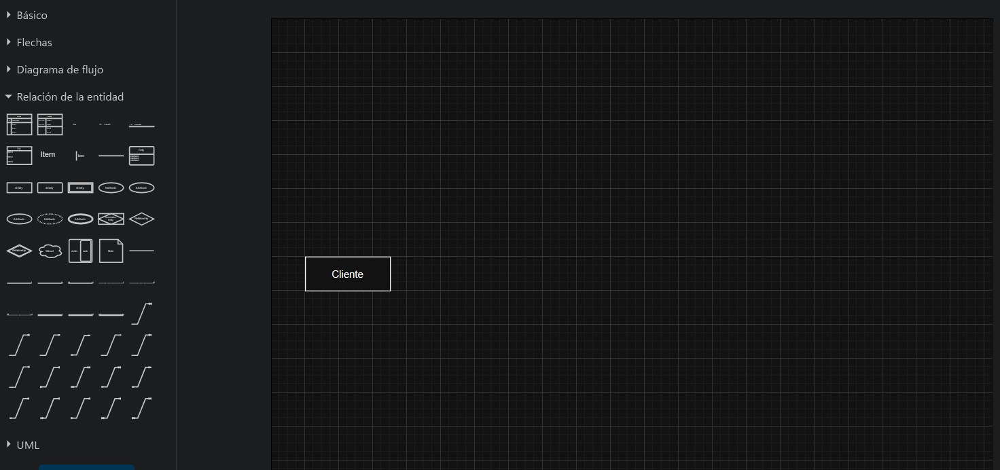
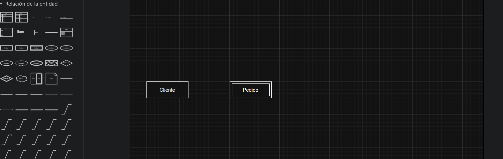
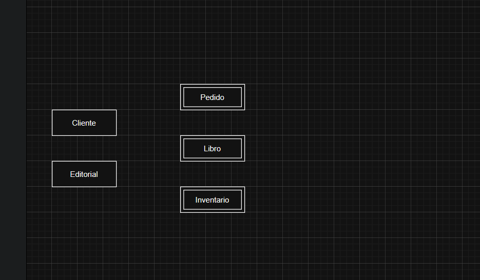

### que son entidades?
la entidad es un objeto unico en el mundo real (cosa o persona)
        clientes de una empresa
        carros que son vendidos
        el departamento de ventas
        los vendedores
        adstractas o tangibles. las representamos a traves de un *rectangulo*

### tipos de entidad

existen 2 tipos de entidades

        entidad Fuerte: Existe y no necesita de otras entidades para existir. es independiente de otras entidades

        Entidad debil: depende de la existencia de otra entidad.

ejemplo:

        empleado y dependiente del empleado

una entidad siempre tendra una clave principal
la entidad debil tendra una clave parcial que depende de la clave principal

Entidades en el DER

### Lo que aprendimos en esta aula:

    Identificar los tipos de entidades.
    Diferenciar las entidades fuertes de las entidades débiles.
    Representar las entidades en diagrams.net.

