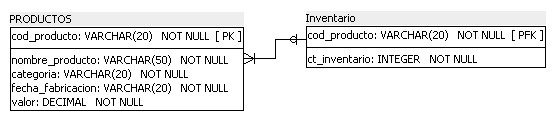
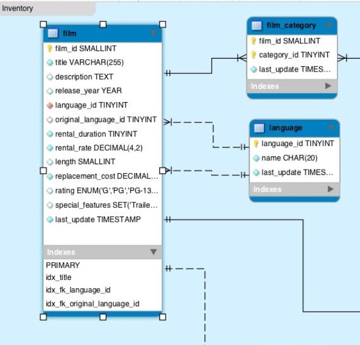
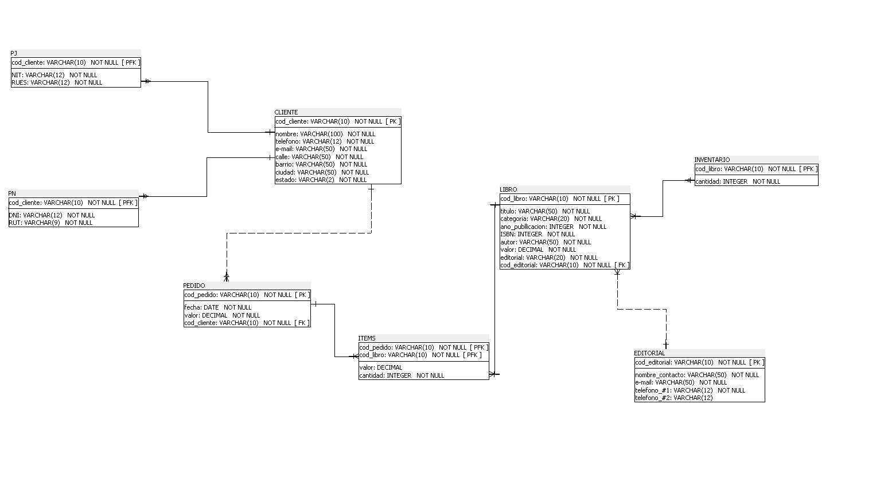

### Identificadora vs. No Identificadora

Martha inició la creación de las relaciones entre las tablas, determinando las relaciones identificadoras y no identificadoras, pero algunas personas del equipo aún no entendieron muy bien la diferencia entre estos dos tipos de relaciones.

Con base en lo que aprendimos durante el aula, marca la alternativa que describe la diferencia entre estos dos tipos de relaciones:

La relación identificadora es aquella en que una ocurrencia de la entidad débil necesita estar asociada a exactamente una ocurrencia de la entidad fuerte y no puede existir sin ella. Es utilizada para representar una clave principal foránea, en cuanto a la relación no identificadora, cada ocurrencia de la entidad débil puede ser identificada sin la necesidad de saber a cuál ocurrencia de la entidad fuerte está asociada. En este caso, esta relación es utilizada solamente para claves foráneas.

Estas son las diferencias entre estos dos tipos de relaciones.

### Representando la cardinalidad

¡Ya casi culminamos! Y, claro, tú, así como Johanna quien nos acompañó durante nuestros estudios sobre los modelos lógicos y físicos de un banco de datos, aprendió bastante sobre todo este contenido.

Y, para no perder el impulso, nuestra compañera de estudios vino con un desafío adicional para auxiliar en nuestra jornada. ¿Cómo sería interpretada la representación de la cardinalidad del siguiente ejemplo, que Johanna retiró de su material de estudios?

Con base en lo que aprendimos, escoge cuáles alternativas definen mejor la representación de la cardinalidad en el ejemplo que presentamos:

La cardinalidad mínima de la tabla inventario es 1 y la máxima es N, representada en el modelo en el extremo más distante, al lado de la tabla de producto.

La cardinalidad es representada en el extremo opuesto a la tabla. En el ejemplo, el tridente (pie de gallina) y el trazo en la vertical nos dice que la cardinalidad de la tabla inventario, contenida en el otro extremo, es (min: 1, max: N).

La cardinalidad mínima de la tabla productos es 0 y la máxima es 1, representada en el modelo en el extremo más distante, al lado de la tabla de inventario.

La cardinalidad es representada en el extremo opuesto a la tabla. En el ejemplo, el círculo tangente al trazo vertical nos dice que la cardinalidad de la tabla producto, contenida en el otro extremo, es (min: 0, max: 1).

### Para saber más: representación del modelo físico

Así como en el modelo lógico, podemos encontrar diversas formas de representar el modelo físico en un proyecto de bases de datos. En SQL Power Architect los atributos son representados de forma vertical, el campo que es clave principal recibe el símbolo de PK y el campo que es clave foránea recibe el símbolo de FK. Las relaciones son representadas con símbolos semejantes a patas de gallina, o tridentes:

Otros softwares pueden utilizar una representación diferente para el modelo físico, como por ejemplo MySQL Workbench, en el cual los atributos son representados de forma vertical. Las relaciones entre las tablas son representadas con símbolos semejantes a patas de gallina, o tridentes, como en SQL Power Architect; ya el campo definido como clave principal recibe el símbolo de una clave en color amarillo y la clave foránea recibe el símbolo de un rombo de color anaranjado.

También podemos considerar la utilización del SGBD para representar el modelo físico, o sea, tras la creación del modelo lógico pasamos directamente para la implementación del proyecto en un SGBD.

### Lo que aprendimos en esta aula:

    Diferenciar las relaciones identificadoras y no identificadoras;
    Representar la cardinalidad de las relaciones;
    Diferenciar la representación del modelo físico de acuerdo con el software utilizado;
    Construir un modelo físico.

