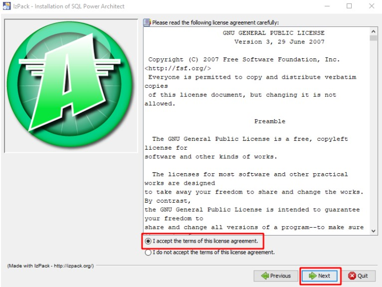

### Preparando el ambiente: instalando SQL Power Arquitect

Como prerrequisito, para realizar la instalación de la herramienta SQL Power Architect en tu ambiente, es necesario que Java esté instalado. En caso de que no lo tengas o quieras actualizar tu ambiente, puedes realizar la instalación a través de este link:

Instalando o Java  https://www.java.com/download/manual.jsp

Instalando SQL Power Architect

Accede al enlace, para realizar el download de SQL Power Architect.  https://bestofbi.com/architect-download/

Al acceder a la página, localiza la opción SQL Power Architect community edition.

Al hacer clic en la opción SQL Power Architect community edition, serás redireccionado para escoger el sistema operativo que utilizas. Haz clic en Download SQL Power Architect para tu OS y el download será iniciado.

Tras realizar el download, localiza en el directorio el archivo descargado y ejecuta el instalador de SQL Power Architect.

En la ventana de bienvenida, haz clic en Next.

Selecciona la opción I accept the terms of this license agreement para aceptar los términos de la licencia y haz clic en Next.

Confirma el directorio de instalación y haz clic en Next.

Tras finalizar la instalación haz clic sobre Next.

Desmarca la opción Create shortcuts in the Start-menu en caso de que no desees crear un atajo para el programa y haz clic en Next.

Haz clic en Done para cerrar el instalador.

¡Ahora, sí estamos listos! Puedes comenzar a utilizar SQL Power Architect.

### Tablas
Ahora que Johanna comenzó a aprender que es un modelo físico del proyecto de una base de datos, ella está motivada a ponerse manos a la obra.

De acuerdo con lo que aprendimos en las aulas, ¿Cuáles serían los pasos para la creación de la tabla del modelo físico dentro del software SQL Power Architect?

Hacer clic en New Table (o digitar la tecla T) y arrastrar dentro del área en la pantalla para diseñar la tabla y crear el nombre lógico (como lo referenciamos en el modelo), el nombre físico (como implementaremos la base de datos) y una clave principal.

Felicitaciones, El modo de crear una tabla en SQL Power Architect sigue exactamente este camino.

### Columnas en el modelo físico

En la construcción de las columnas vamos a determinar su tipo lo que determinará las características de los datos contenidos en cada columna.

Determinar el tipo de cada columna será esencial en la construcción de nuestra base de datos para lograr identificar los datos contenidos en cada columna.

Las columnas representan los atributos o campos de las entidades (ahora denominadas tablas) dentro del modelo físico. Al adicionarlas vamos a escoger un nombre lógico y físico.

Lo que era conocido como atributo o campo en el modelo lógico ahora será denominado columna en el modelo físico.

### Para saber más: opciones de software para la creación del MFD

Durante este curso el instructor utilizará el software SQL Power Architect para la creación del modelo físico del proyecto, pero esta no es la única herramienta existente para que trabajemos en esta etapa del modelado. Presentaremos aquí otras opciones para que experimentes y aprendas un poco más sobre los otros softwares que pueden ser utilizados en este proceso.

MySQL Workbench es una herramienta muy utilizada en el modelado de bases de datos. Se trata de un software bien completo que nos posibilita crear todos los procesos de modelado de banco de datos además de hacer alteraciones al mismo, que normalmente serían más trabajosas utilizando recursos-clave de modo que sea preciso menos tiempo y esfuerzo en estos procesos. https://www.mysql.com/products/workbench/

Astah Profesional es otro software que abarca completamente todas las etapas del proceso de modelado de bases de datos. Este permite generar códigos a partir de los diagramas creados o hacer una ingeniería inversa en los códigos existentes.  https://astah.net/downloads/

DBDesigner 4 posee una interfaz bien intuitiva lo que facilita su aplicación. Este es muy utilizado en las universidades durante el proceso de aprendizaje de modelado. Esta herramienta también puede ser utilizada en conjunto con MySQL.  https://www.fabforce.net/dbdesigner4/downloads.php

La elección del software va a depender mucho de tus preferencias y necesidades ya que la mayor parte de ellos poseen funcionalidades parecidas. La recomendación es utilizar un software que ya esté en el mercado hace algún tiempo y sea confiable, como todos estos ejemplos que mencionamos aquí. Te sugerimos que leas un poco más a fondo sobre el software que irás a escoger para trabajar antes de comenzar con tu proyecto, teniendo en cuenta las necesidades específicas de tu proyecto.

### Lo que aprendimos en esta aula:

    Instalar SQL Power Architect;
    Identificar el modelo físico;
    Construir tablas en el modelo físico;
    Construir columnas en el modelo físico;
    Reconocer otras herramientas de software para la creación del modelo físico.

