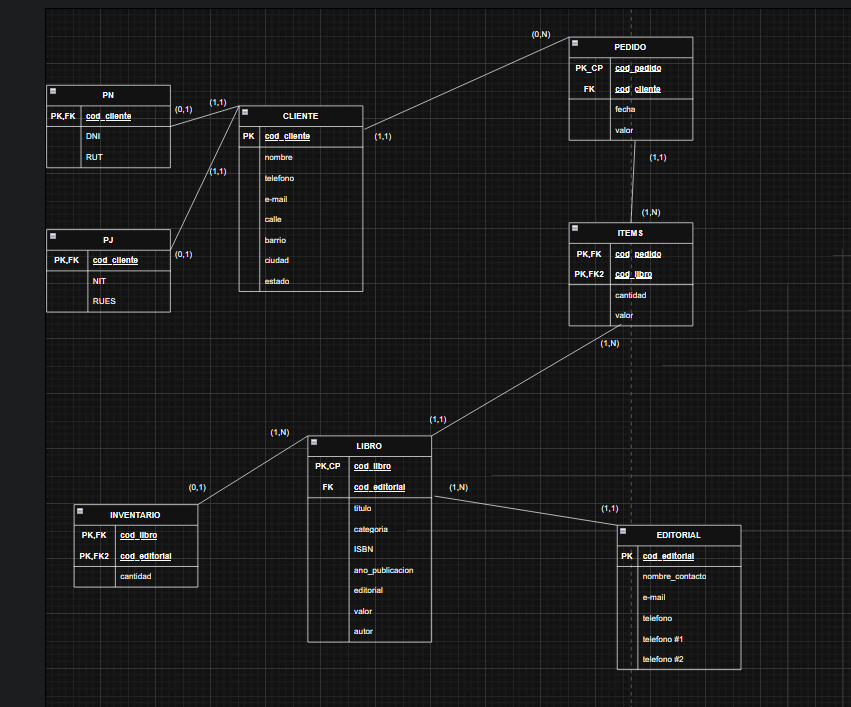
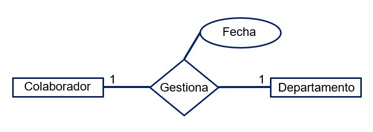
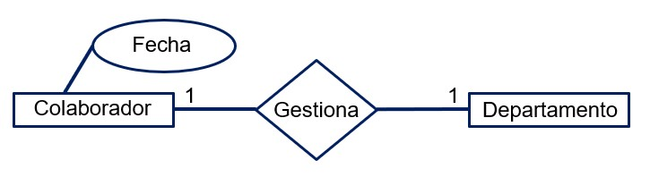
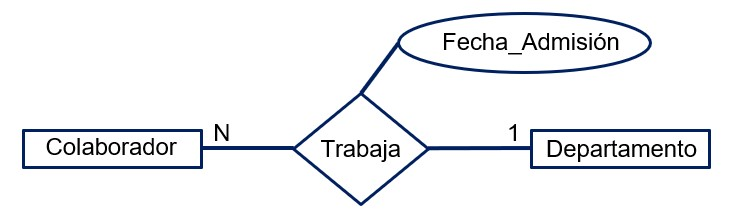
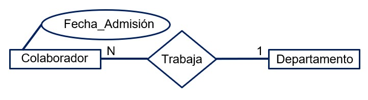
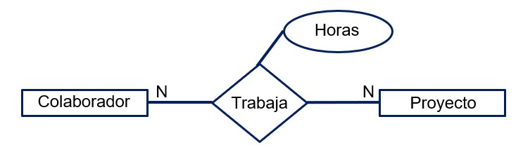

### Clasificando items en el MLD

Ahora que Martha inició con la construcción del modelo lógico, ella va a transferir la información del modelo conceptual dejándolo estructurado en forma de tabla. Antes de continuar con este paso, Johanna presentó algunas dudas en cuanto a la clasificación de los atributos y entidades dentro de este nuevo modelo.

Con base en lo que aprendimos, clasifica los datos del siguiente modelo lógico determinando la relación/tabla, el atributo clave principal y los atributos simples para ayudar a Johanna a entender este proceso.
Colaborador(a)		1
id_colaborador(a)		2
nombre		3
teléfono		4
dirección		5
% de comisión		6

1 - relación/tabla; 2 - atributo clave principal; 3 - atributo simple, 4 - atributo simple, 5 - atributo simple, 6 - atributo simple.

Colaborador(a) es la tabla y el atributo que es único para cada inserción de la tabla es ID_Colabolador(a), este nos ayudará a identificar cada fila de la tabla. Todos los demás atributos pueden considerarse como atributos simples.

### Para saber más: atributos de relaciones

Al desarrollar el modelo conceptual de un proyecto, podemos identificar que algunas relaciones poseen atributos, que son normalmente conocidos como atributos de relación. Estos atributos están directamente vinculados a una relación, pero durante el proceso de desarrollo del modelo conceptual es necesario mover estos atributos para una de las entidades participantes de relación y ellos pasan a ser conocidos como atributos migrados.

Existen reglas para que la migración del atributo de relación para una entidad sea hecho. En relaciones del tipo 1:1 o 1:N pueden ser migrados para una de las entidades participantes:

En relaciones 1:1 el atributo puede ser migrado para cualquier una de las entidades pertenecientes a la relación, ya que las dos entidades reciben apenas una instancia por vez de la relación.

Vamos a utilizar como ejemplo la siguiente relación, en la cual es necesario almacenar la información de cuando el colaborador(a) comenzó a gerenciar el departamento.

Al leer la cardinalidad:

Un colaborador(a) gestiona apenas un departamento, o sea, la entidad colaborador(a) recibe apenas una ocurrencia a la vez de la relación.

Un departamento puede ser gestionado apenas por un colaborador(a), o sea, la entidad departamento recibe apenas una ocurrencia a la vez de la relación.

Aunque conceptualmente este pertenezca a la relación “gestiona”, el atributo fecha puede ser migrado para cualquiera de las entidades participantes de la relación, pues las dos entidades reciben apenas una ocurrencia a la vez de la relación.

En las relaciones 1:N el atributo será migrado para la entidad que recibe apenas una instancia a la vez de la relación. Vamos a utilizar como ejemplo la siguiente relación. En ella es necesario almacenar la información sobre cuándo el colaborador(a) comenzó a trabajar para el departamento.

Al leer la cardinalidad:

Un colaborador(a) trabaja tan solo para un departamento, o sea, la entidad colaborador(a) recibe apenas una ocurrencia a la vez de la relación.

Un departamento puede tener varios colaboradores(as), o sea, la entidad departamento recibe varias ocurrencias de la relación.

Siendo así, migramos el atributo para el lado N de la relación, para la entidad colaborador(a), pues esta entidad recibe apenas una ocurrencia a la vez de la relación.

En las relaciones N:M, la regla es un poco diferente, ya que ninguna de las entidades participantes de la relación reciben apenas una instancia a la vez de la relación. En estos casos, los atributos no son migrados hacia una entidad y permanecen en la relación, creando así una nueva entidad, conocida como entidad asociativa. Esta es compuesta por los atributos provenientes de las dos entidades vinculadas a la relación y por sus propios atributos.

Vamos a utilizar como ejemplo la siguiente relación, donde es necesario almacenar la información de cuántas horas un colaborador(a) trabaja en un proyecto.

Al leer la cardinalidad:

Un colaborador(a) trabaja en varios proyectos, o sea, la entidad colaborador(a) recibe varias ocurrencias de la relación.

Un proyecto puede tener varios colaboradores(as) trabajando, o sea, la entidad proyecto recibe varias ocurrencias de la relación.

Siendo así, no migramos el atributo para una de las entidades participantes de la relación, ya que las dos entidades reciben varias ocurrencias a la vez de la relación que, posteriormente, se convertirá en una nueva entidad.

### Lo que aprendimos en esta aula:

    Nombrar los items en el modelo lógico;
    Construir el modelo lógico de la base de datos;
    Representar las entidades fuertes y débiles en el modelo lógico;
    Diferenciar los atributos de relaciones: Especialización y generalización.

