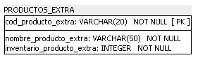

### Tipos de datos en el modelo físico

Martha elogió bastante la evolución de Johanna y como ella viene desempeñándose realizando el modelado de bases de datos. Ahora, tras aprender qué es el modelado físico y cómo crear una tabla en SQL Power Architect, ella recibió la función de implementar el modelo físico del Club del Libro y, para ello, necesita traducir el modelo lógico al modelo físico.

Para llenar junto a ella las tablas de nuestro modelo físico, necesitamos estar bien atentos a los tipos de datos y cómo queremos que estos sean futuramente almacenados en nuestra base de datos.

Con base en lo que aprendimos hasta aquí, escoge las alternativas que mejor describen los tipos de datos y cómo pueden ser utilizados:

En un modelo físico, podemos utilizar el tipo VARCHAR para describir una columna de código del cliente, visto que este tipo permite el uso de datos alfanuméricos, o sea, tanto números como letras.

El tipo VARCHAR permite el uso de datos alfanuméricos, siendo muy común utilizarlos en casos como este.

En un modelo físico, podemos utilizar el tipo FLOAT para describir una columna de precio de un producto, visto que este tipo permite el uso de datos tanto en el formato entero como en el decimal.

El tipo FLOAT permite el uso de datos tanto en el formato entero como en el decimal, siendo muy utilizado tanto para valores como para cantidades expresadas con valores decimales.

### Para saber más: otros tipos de datos

Al desarrollar el modelo físico pasamos a especificar el dominio que cada columna de la tabla va a pertenecer, o sea, cuáles son los tipos de datos que cada campo irá a recibir. Los tipos de datos normalmente son definidos en categorías: Tipos numéricos, de fecha y de cadenas de caracteres, son las más conocidas.

Entre los tipos de datos numéricos tenemos:

Int almacena valores numéricos enteros.

Float almacena valores numéricos aproximados con precisión de punto flotante.

Decimal almacena valores numéricos con casas decimales, utilizando precisión.

Entre los tipos de datos de cadenas de caracteres:

Varchar almacena valores de string de tamaño variable de acuerdo con su límite.

Char almacena valores de string de tamaño fijo.

Text almacena valores de string de tamaño variable.

Entre los tipos de datos de fecha tenemos:

Date almacena apenas los valores de fecha.

Time almacena apenas los valores de hora.

Timestamp almacena valores de fecha y hora.

Estos son tan solo algunos ejemplos de tipos de datos que pueden ser utilizados para definir el dominio de una columna. Este uso puede variar entre los diversos SGBDs.

### Creando una tabla en el modelo físico

El club del libro adicionó algunos productos además de los libros y pidió que Martha añadiera una tabla más al modelo físico. Cómo el proyecto ya está a mitad del camino, Martha solicitó que fuera detallada la información sobre cómo debería ser esta nueva tabla.

Informaron que la tabla tendrá toda la información sobre los productos extra como el código del producto, que será generado por una secuencia de 20 números y letras, el nombre del producto y la cantidad del producto en inventario.

Teniendo en cuenta lo que aprendimos durante el aula, ¿Cómo quedaría la clasificación de esa tabla y sus respectivas columnas, excluyendo por ahora las posibles relaciones, dentro de un modelo físico?

Esta sería la forma correcta de representar la tabla de productos extras dentro del modelo físico. Las columnas “Cod_producto_extra” y “Nombre_producto_extra” son del tipo varchar, ya que este tipo permite el uso de datos alfanuméricos, o sea, tanto números como letras. La columna “Inventario_producto_extra” será del tipo integer pues se trata de la cantidad de productos en el inventario, que será representado por un número entero.

### Lo que aprendimos en esta aula:

    Identificar los tipos de datos de las columnas;
    Conocer otros tipos de datos;
    Construir una tabla en el modelo físico;
    Construir una columna en el modelo físico.

