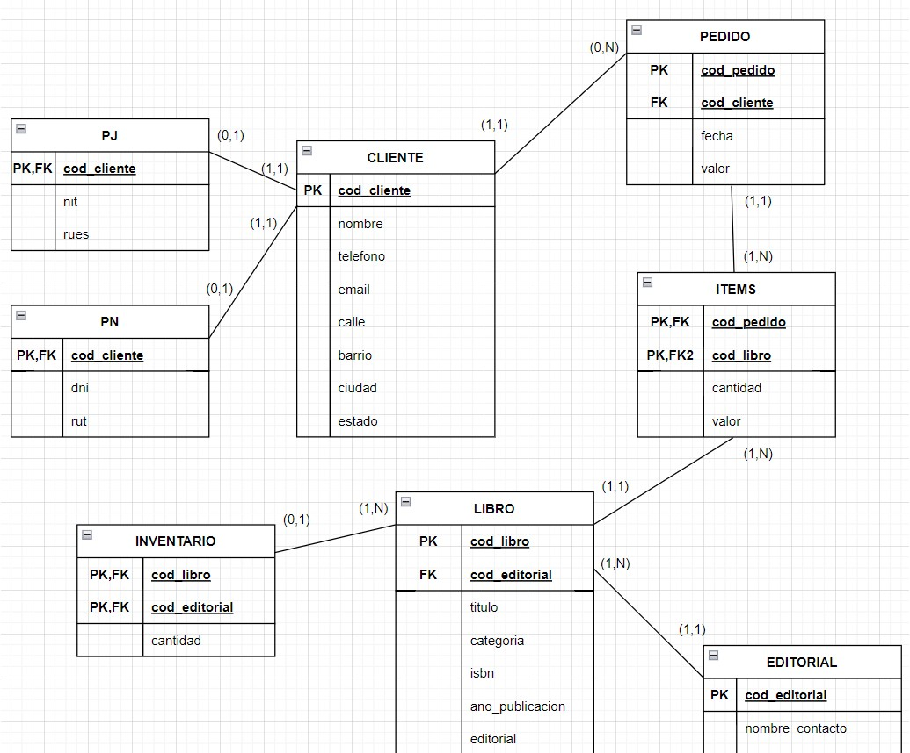

### Características de MLD y MFD

Una de las integrantes del equipo de Martha, Johanna, estaba tratando de entender las características que diferencian los Modelos Lógicos de Datos (MLDs) de los Modelos Físicos de Datos (MFDs). Para ello, a Martha compartió con ella un material para profundizar sus estudios y prepararla para la implementación del proyecto de bases de datos del Club del Libro. ¡Vamos a ayudarle a Johanna!

De acuerdo con lo que aprendimos en los videos, ¿Cuáles alternativas definen mejor las características y diferencias entre los Modelos Lógicos de Datos (MLDs) y los Modelos Físicos de Datos (MFDs)?

    Alternativa correta

    El Modelo Físico de Datos (MFD) es ampliamente utilizado en proyectos tanto ágiles como tradicionales y presenta el proyecto de la base de datos con una mayor riqueza de detalles frente al Modelo Lógico de Datos (MLD).

El Modelo Físico de Datos (MFD) es ampliamente utilizado por presentar detalles como las tablas asociativas, por indicar los tipos de datos de cada campo y las claves que serán necesarias para trazar las relaciones.
Alternativa correta

El Modelo Lógico de Datos (MLD) es raramente utilizado en proyectos ágiles, pues el enfoque de este modelo radica en describir los conceptos de dominio involucrados en una base de datos.

El Modelo Lógico de Datos (MLD) raramente es utilizado en proyectos ágiles, al contrario del Modelo Físico de Datos (MFD).

###  Para saber más: representando el modelo lógico

El modelo lógico de datos es creado a partir de las descripciones de los datos representadas en un modelo conceptual. Este describe cómo los datos serán almacenados en la base de datos, identificando las entidades, los atributos, las claves principales y foráneas y sus relaciones.

Hay dos formas que podemos utilizar para representar el modelo lógico: La forma horizontal o la forma vertical. Durante el curso fue utilizada la representación vertical, donde los atributos (que más adelante serán llamados campos) son representados uno abajo del otro, los atributos clave son identificados y las relaciones son representadas a través de líneas uniendo una relación a la otra:

En la forma horizontal, los atributos (campos) son presentados uno al lado del otro, los atributos clave son subrayados en las relaciones y las relaciones son representadas a través de una flecha, que sale de la relación dependiente y llega a la relación propietaria. Ya las cardinalidades no son representadas, como en el ejemplo a continuación:

Las dos formas son válidas y pueden ser utilizadas para representar el modelo lógico de datos. Normalmente la forma más utilizada es la forma vertical, por ser semejante a la representación final de las relaciones en una base de datos.

### Pasos para el MLD

El proceso de modelado de bases de datos no se inicia con la construcción del modelo lógico; este sigue algunos pasos anteriores que irán a ayudar en la construcción de este modelo, es decir, los pasos que acompañamos en el proyecto desarrollado por Martha hasta aquí.

Con base en lo que aprendimos hasta ahora, ¿Cuáles son estos pasos y cuál es su orden en el proceso de modelado de bases de datos?

    Alternativa correta

    Entrevista con el usuario, creación del mini mundo, modelo conceptual, modelo lógico y modelo físico.

Siguiendo todos los pasos indicados es posible modelar una base de datos atendiendo todos los requisitos del usuario.

### Lo que aprendimos en esta aula:

    Diferenciar y caracterizar los modelos lógico y físico;
    Conocer las formas de representación del modelo lógico;
    Representar el modelo lógico utilizando Diagrams.net.

